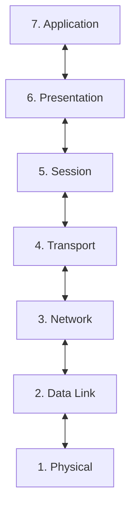

# OSI Model

## OSI Layers

### 3. Network

Routing data and logical addressing (e.g. IP), determining the best path from source to destination across networks.

### 2. Data Link

1. Recieves data from physical layer
2. Checks for transmission errors
3. Packages bits to data frames (e.g.: `| MAC1 | MAC2 | IP1 IP2 Segment | FCS`)
4. Manage physical adressing layer:
  - Media Access Control (MAC)
  - Logical Link Control (LLC)

### 1. Physical

Handles the transmission and reception of raw bitstreams over a physical medium.

Examples: network cable, power plug, cable pinouts, wireless radio frequencies, transcievers, repeaters, pulses of light etc.
